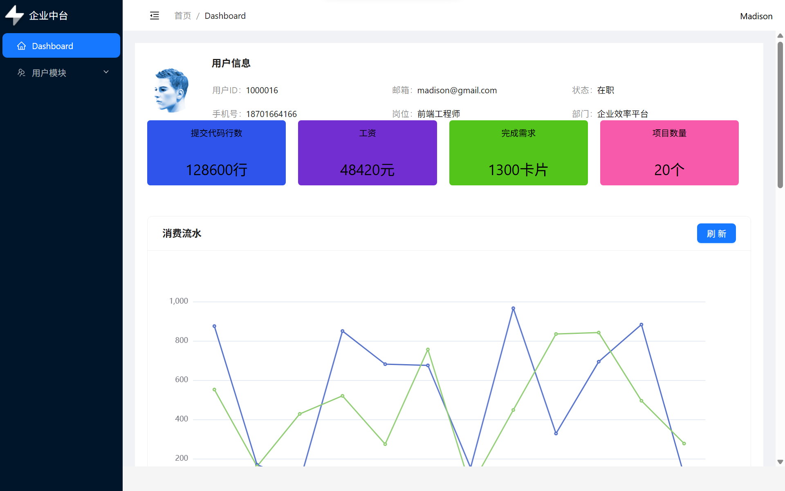
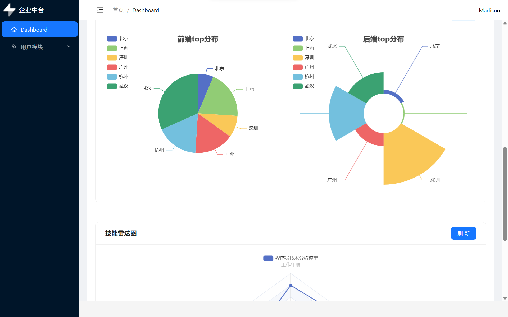
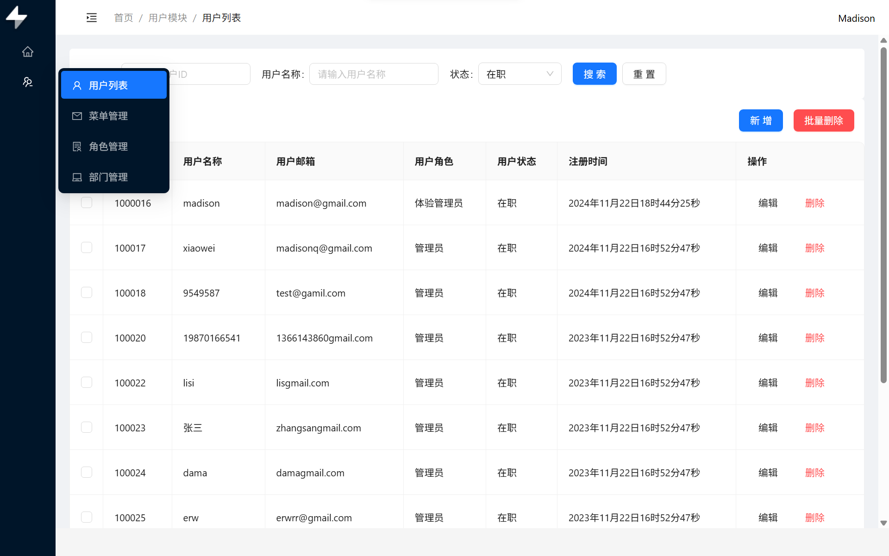
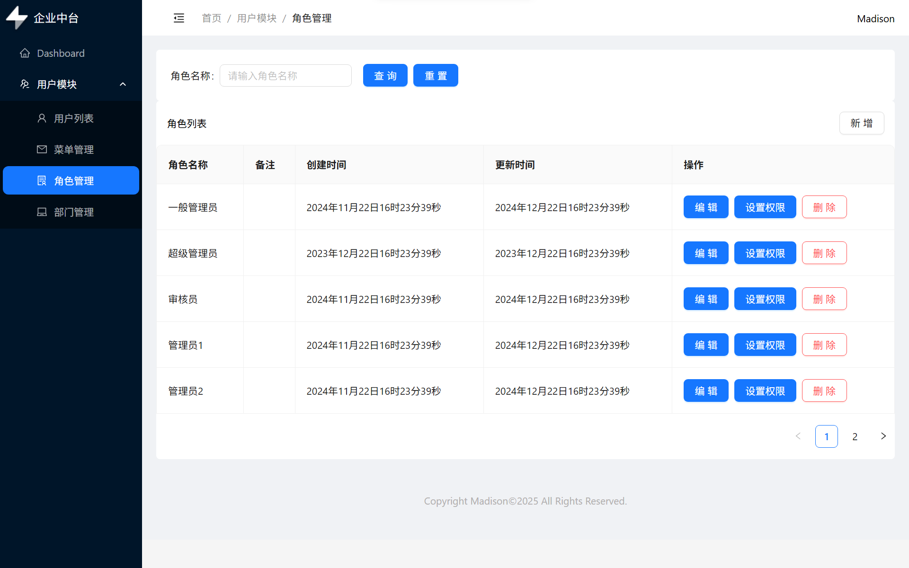
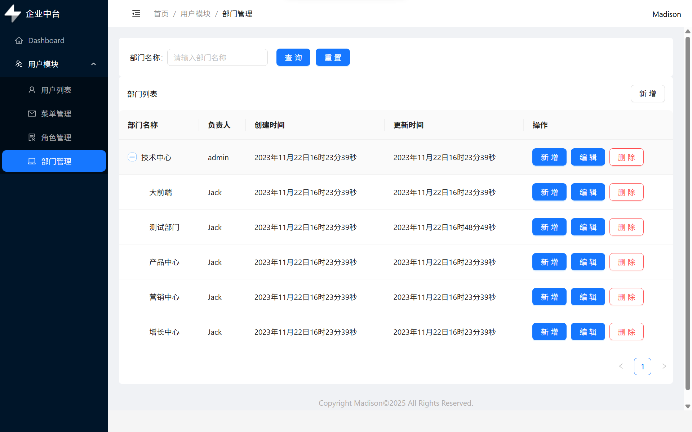

# Nebula Admin（星云中台）

一个基于 **React 18 + TypeScript + Vite + Ant Design + ECharts** 的中后台管理系统项目，包含登录、布局、用户/部门/菜单/角色管理与可视化看板。

> 目标：用一个“能跑、能看、能聊”的项目，支撑前端实习/校招面试中的技术与工程化表达。


## 功能一览

- 登录页（保存 token 到 localStorage）
- 通用后台布局：侧边栏菜单 + 顶部栏 + 内容区 + Footer
- 路由：React Router v7 + 懒加载（Suspense + Spin）
- 用户管理：搜索 + 列表 + 新增/编辑 + 单删/批量删除（`ahooks/useAntdTable`）
- 部门管理 / 菜单管理 / 角色管理 / 权限设置页面（按中台常见 CRUD 模式组织）
- Dashboard：ECharts 折线图/饼图/雷达图（`useCharts` hook 封装）
- 请求封装：Axios 实例 + 拦截器 + 统一错误提示（AntD message）
- 构建优化：手动分包 + 构建分析报告（rollup visualizer）+ 预取（prefetch）部分懒加载 chunk

## 技术栈

- UI：Ant Design、@ant-design/icons
- 状态管理：Zustand
- 网络请求：Axios（`src/utils/request.ts`）
- 数据可视化：ECharts 
- 工具库：ahooks
- 工程化：Vite、ESLint、Less、CSS Modules

## 快速开始

建议使用 **pnpm**（仓库已包含 `pnpm-lock.yaml`）。Vite 6 通常需要较新的 Node 版本（建议 Node 18+）。

```powershell
pnpm install
pnpm dev
```

启动后访问（以终端输出为准）：

- http://localhost:5173/

## 环境变量与接口代理

本项目通过 `VITE_BASE_URL` 控制请求前缀：

- 开发环境：`.env.development`
  - `VITE_BASE_URL=/api`
  - Vite devServer 会把 `/api` 代理到 Apifox Mock（见 `vite.config.ts`）
- 构建环境：`.env.prod` / `.env.qa`（示例里是占位域名，可自行替换）

如需对接你自己的后端：

1. 修改 `.env.development` / `.env.prod` 的 `VITE_BASE_URL`
2. 或修改 `vite.config.ts` 的 `server.proxy['/api'].target`

## 常用脚本

```powershell
pnpm dev       # 本地开发
pnpm lint      # ESLint
pnpm build     # 生产构建（--mode prod）
pnpm qa        # QA 构建（--mode qa）
pnpm preview   # 本地预览构建产物
```

> `vite.config.ts` 中开启了 `rollup-plugin-visualizer`（构建后会生成报告并尝试自动打开）。

## 项目结构（速读版）

```text
src/
  api/            # API 聚合层
  components/     # 通用组件（如 SearchForm）
  hooks/          # 自定义 hooks（如 useCharts）
  layout/         # 后台布局（header/footer/menu）
  router/         # 路由与懒加载封装
  store/          # Zustand 全局状态
  styles/         # 全局样式/主题
  types/          # TS 类型定义（接口入参/返回）
  utils/          # request/storage/工具方法
  views/          # 页面（login/dashboard/user/dept/menu/role...）
```

## 项目亮点

- **路由性能**：页面级懒加载 + `prefetch` 预取常用页面 chunk（见 `vite.config.ts`）
- **请求层抽象**：Axios instance、超时与统一错误提示、登录失效跳转（见 `src/utils/request.ts`）
- **状态管理**：用 Zustand 管理侧边栏折叠、当前菜单、用户信息（见 `src/store/index.ts`）
- **可视化封装**：ECharts 初始化抽成 `useCharts` hook，让页面只关注 `setOption`（见 `src/hooks/useCharts.ts`）
- **工程化**：手动分包（React/AntD/ECharts vendor）、构建可视化分析（见 `vite.config.ts`）
- **样式方案**：Less + CSS Modules，避免全局污染，便于组件化维护

## 接口说明

项目包含一份接口整理：`接口.md`。

### UI 展示












## License

MIT License